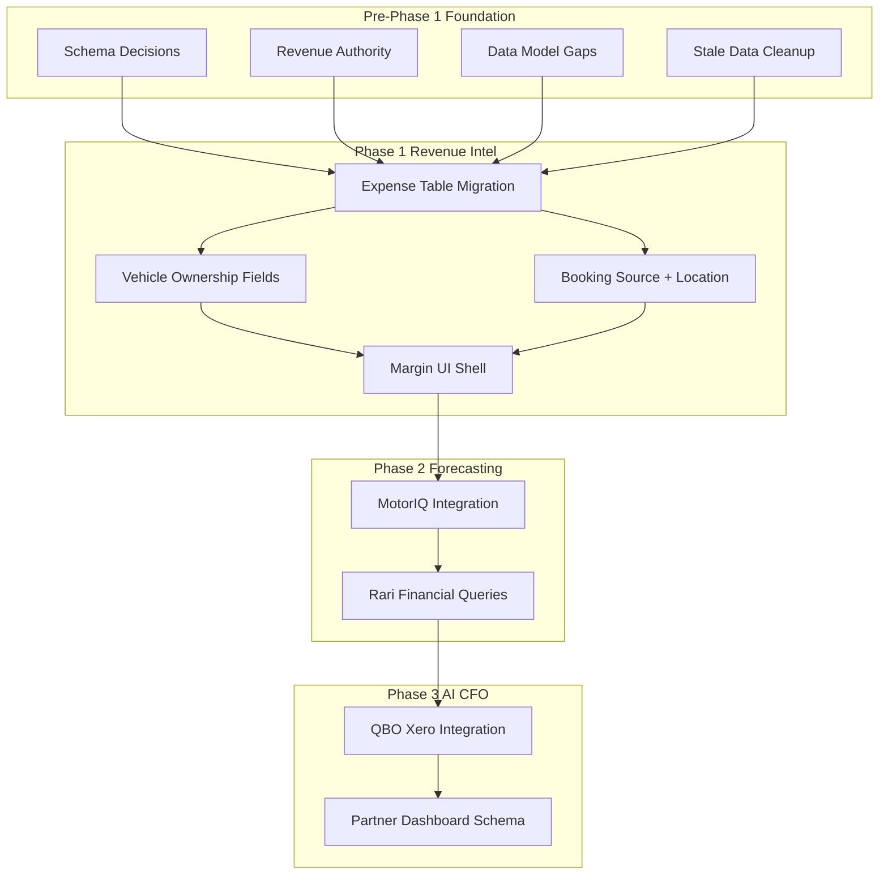

# Margin Module Phased Implementation Plan

## Executive Summary

This plan implements the Margin module from Exotiq_Margin_Module_Brief_v2 with strict regression controls. Every schema change, trigger, and hook is validated against existing consumers. The [MARGIN_MODULE_REVIEW.md](MARGIN_MODULE_REVIEW.md) findings are incorporated as mandatory pre-work.

---

## Critical Dependency Map

---

## Pre-Phase 1: Foundation (Mandatory Before Any Margin Work)

### 1.1 Schema Decision: Extend `vehicle_expenses`, Do NOT Create `expense_records`

**Current state:** [supabase/migrations/20260108_rari_enterprise_schema.sql](supabase/migrations/20260108_rari_enterprise_schema.sql) defines `vehicle_expenses` with `expense_type` CHECK (fuel, insurance, maintenance, cleaning, storage, registration, detailing, toll, parking, other). The `vehicle_profit_loss` view (lines 254-292) reads from it.

**Regression check:** `vehicle_expenses` and `vehicle_profit_loss` are **not referenced** in frontend code. Rari handlers ([rari-enterprise-handlers/index.ts](supabase/functions/rari-enterprise-handlers/index.ts), [rari-universal-query/index.ts](supabase/functions/rari-universal-query/index.ts)) compute P/L from `maintenance_schedules` + `damage_claims` directly. Extending `vehicle_expenses` will not break any existing code.

**Action:** Create a single migration that:

- Adds `location_id UUID REFERENCES locations(id)` (nullable)
- Adds `source_module VARCHAR(50)` CHECK (vault, pulse, margin_manual, bookings, motoriq)
- Adds `source_record_id UUID` (nullable)
- Expands `expense_type` CHECK to include: damage, partner_payout, depreciation, loan_payment, acquisition, transport, tax (in addition to existing)
- Makes `vehicle_id` nullable (for org-wide overhead)
- Adds `org_id` or ensures `team_id` is used for team-scoped overhead (vehicles already have team_id; expense records need team_id for RLS)

**View update:** `vehicle_profit_loss` aggregates by `vehicle_id`. Overhead expenses (vehicle_id NULL) must be excluded from per-vehicle totals. Update the view's expense subquery to `WHERE vehicle_id IS NOT NULL` so overhead does not double-count. Document that overhead flows into location/org-level P&L only.

### 1.2 Revenue Authority: Document and Implement

**Current state:** [MARGIN_MODULE_REVIEW.md](MARGIN_MODULE_REVIEW.md) and exploration confirm:

- Booked revenue: `bookings.total_value` (Supabase)
- Collected revenue: `payments.amount` (Supabase)
- [stripe-get-balance](supabase/functions/stripe-get-balance/index.ts) uses Stripe for balance, falls back to `payments` for total_collected
- No Stripe webhook syncs PaymentIntents into `payments`

**Decision required:** Brief says "Stripe Connect as Single Source of Truth." Options:

- **A) Supabase remains authority (recommended for Phase 1):** Keep `bookings` + `payments` as source. Add Stripe webhook later to sync completed payments into `payments`. Margin reads from Supabase.
- **B) Stripe as authority:** Margin reads from Stripe API only. Requires webhook to populate a cache table and deprecate direct `payments` usage for revenue.

**Recommendation:** Option A. Document in codebase: "Phase 1 Margin uses Supabase bookings + payments. Stripe webhook sync is Phase 2/3." Add a `MARGIN_REVENUE_SOURCE.md` doc. Do not change existing RevenueWidget, PaymentsSection, or stripe-get-balance behavior.

### 1.3 Add `booking_source` to Bookings

**Current state:** [lead_sources](supabase/migrations/20260108_rari_enterprise_schema.sql) has `source` CHECK (turo, getaround, website, ...) but no `drive_exotiq`. Bookings have no `booking_source` column.

**Action:** Add `booking_source VARCHAR(50)` to `bookings` with CHECK (direct, drive_exotiq, turo, getaround, website, referral, other). Default `direct`. Add migration. Update TypeScript types. No existing code filters by booking_source; safe.

### 1.4 Per-Location Revenue: Derive or Add `location_id`

**Current state:** Bookings have `pickup_location_id`, `dropoff_location_id`. Vehicles have `location_id`. [vehicle_profit_loss](supabase/migrations/20260108_rari_enterprise_schema.sql) uses `v.location` (TEXT). [location_comparison](supabase/migrations/20260108_rari_enterprise_schema.sql) groups by `v.location`.

**Action:** For per-location P&L, derive booking location from `vehicle_id` at booking time: JOIN vehicles ON bookings.vehicle_id = vehicles.id, use vehicles.location_id. Add a DB view `booking_location_revenue` that joins bookings -> vehicles -> locations for Margin queries. No schema change to bookings required if we derive. Document: "Booking location = vehicle's location at time of booking."

### 1.5 Vault and Pulse Pre-Work (Schema Only, No Hooks Yet)

**Vault - Insurance:** `documents` table stores insurance (type='insurance'). Add `premium_amount NUMERIC`, `billing_frequency VARCHAR(20)` CHECK (monthly, quarterly, annually) to documents. Migration only. No UI changes until Phase 1 hooks.

**Vault - Claims:** `damage_claims` already has `estimated_cost`, `actual_cost`. No schema change. Hooks will write to expense table when claim is created/updated with cost.

**Pulse - Maintenance:** `maintenance_schedules` has `estimated_cost`. Add `actual_cost NUMERIC` (nullable) for completed events. Migration. Ensure completion flow can set actual_cost.

### 1.6 Stale Data Cleanup

**Action:** Run a one-time audit query to flag records with test/demo patterns (e.g., customer_name = 'Test', vehicle names like 'Demo Ferrari'). Create `scripts/audit_stale_data.sql`. Do not auto-delete; output a report for Gregory to confirm. Add to pre-Margin checklist.

### 1.7 RLS Alignment for `vehicle_expenses`

**Current state:** `vehicle_expenses` uses `auth.uid() = user_id` only. Other tables (vehicles, bookings, payments) use `is_team_member_of_record(auth.uid(), team_id) OR is_super_admin(auth.uid())`.

**Action:** Add team-based and super_admin policies to `vehicle_expenses` in the same migration that extends the table. Follow pattern from [20260103000002_update_rls_for_super_admin.sql](supabase/migrations/20260103000002_update_rls_for_super_admin.sql). Drop old user-only policies, add team-aware ones. Ensure `team_id` is populated (from vehicle or user's default team).

---

## Phase 1: Revenue Intelligence (Replace the Spreadsheet)

### 2.1 Expense Write Hooks (DB Triggers)

Add triggers that write to `vehicle_expenses` (extended schema). Use `source_module` and `source_record_id` for traceability.

| Source | Trigger | Condition | Expense Record |
|--------|---------|-----------|----------------|
| damage_claims | AFTER INSERT OR UPDATE | estimated_cost OR actual_cost IS NOT NULL | category=damage, amount=COALESCE(actual_cost, estimated_cost), source_module=vault, source_record_id=claim.id |
| documents | AFTER INSERT OR UPDATE | type='insurance' AND premium_amount IS NOT NULL | category=insurance, recurring=true, source_module=vault |
| maintenance_schedules | AFTER UPDATE | status='completed' AND (actual_cost OR estimated_cost) IS NOT NULL | category=maintenance, source_module=pulse |
| payments | AFTER INSERT | payment_type='refund' | Negative revenue; Margin treats refunds as deductions, not expenses. Document. |

**Idempotency:** Use `source_record_id` to avoid duplicate expense rows. In trigger: `INSERT ... ON CONFLICT` or check `SELECT EXISTS(expense WHERE source_record_id = NEW.id)` before insert. Prefer a unique constraint on (source_module, source_record_id) for expense records from automated sources.

**Regression:** Existing triggers on damage_claims (notify_new_damage_claim), payments (notify_new_payment), maintenance_schedules (update_updated_at) are independent. New triggers do not modify those.

### 2.2 Vehicle Ownership and Partner Schema (Phase 1 Schema, Phase 3 UI)

Create migrations for:

- `vehicle_partners` table (per brief)
- `partner_payouts` table (per brief)
- Add to `vehicles`: ownership_type, partner_id, split_type, split_value, payout_method, acquisition_cost, monthly_payment, depreciation_method (nullable; Phase 3 fields)

**Regression:** No existing code reads these columns. Add with DEFAULT values where needed (ownership_type DEFAULT 'owned').

### 2.3 Margin Module UI Shell

- Add `margin` to [DashboardSidebarEnhanced.tsx](src/components/dashboard/DashboardSidebarEnhanced.tsx) Operations group, after Pulse
- Add `case "margin": content = <MarginModule />` in [Dashboard.tsx](src/pages/Dashboard.tsx) renderModuleContent
- Create `MarginModule` component as shell with placeholder content
- Add route support for `?module=margin`

### 2.4 Phase 1 Core Deliverables (UI)

1. **Per-vehicle P&L** — Query `vehicle_profit_loss` view (updated to use extended vehicle_expenses). Display table/cards.
2. **Per-location P&L** — Use `booking_location_revenue` view + expense aggregation by location_id.
3. **Real-time revenue dashboard** — Reuse/adapt RevenueWidget, PaymentsSection. Ensure booking_source breakdown (direct vs drive_exotiq) when data exists.
4. **Basic trending** — This month vs last month, this quarter vs last quarter. Use existing date filters.
5. **Manual payment recording** — Brief references Stripe Connect out-of-band. Current [RecordPaymentDialog](src/components/dialogs/RecordPaymentDialog.tsx) + FleetContext.createPayment already insert into `payments`. Verify it supports "manual" payment_method. No change if already works.
6. **Manual expense entry** — New form: insert into `vehicle_expenses` with source_module='margin_manual', category, amount, vehicle_id (optional), location_id (optional).

### 2.5 Payment Data Reconciliation

**Action:** Audit [PaymentsSection](src/components/dashboard/PaymentsSection.tsx) and [stripe-get-balance](supabase/functions/stripe-get-balance/index.ts). Document where $583K collected and $2.8M pending originate. If from different sources, add a reconciliation view or fix the discrepancy. Do not change behavior until understood.

---

## Phase 2: Forecasting Engine

### 3.1 MotorIQ + Rari Integration

- Connect Margin to MotorIQ pricing data for demand-aware revenue forecasting
- Rari financial queries: "What is my net margin on the McLaren fleet?" — Rari handlers already support P/L; extend to use `vehicle_profit_loss` or new Margin-specific query
- Cash flow projections from confirmed bookings + conversion probability (placeholder initially)
- What-if scenarios via Rari conversational flow

### 3.2 Gemini API Event Data (Brief)

Event data for demand forecasting. Integrate Gemini API for events (replacing PredictHQ). Feed into MotorIQ, then Margin. Scope as separate sub-project.

---

## Phase 3: AI CFO

### 4.1 QuickBooks / Xero Integration

- One-way sync: export P&L to QBO. Map expense categories to QBO chart of accounts.
- OAuth app registration on Intuit/Xero developer portal
- Phase 3 only; schema is already designed for clean export (expense_type maps to QBO categories)

### 4.2 True Net Margin, Alerts, Board Reports

- Net margin = revenue - all costs (maintenance, insurance, depreciation, storage, loan payments, overhead)
- Proactive AI alerts via rari_insights
- Board-ready report generation via Rari

### 4.3 Vehicle Partner Dashboard

- Permission-scoped read-only view for vehicle partners
- Uses vehicle_partners, partner_payouts, visibility_settings
- Schema built in Phase 1; UI in Phase 3

---

## Regression Safeguards Checklist

| Area | Check | Mitigation |
|------|-------|------------|
| vehicle_expenses | No frontend references | Extend in place; update view |
| vehicle_profit_loss | View depends on vehicle_expenses | Update view in same migration; test view query |
| RLS | vehicle_expenses user-only | Add team/super_admin; test with multi-tenant |
| damage_claims trigger | Existing notify trigger | Add separate expense trigger; no modification to notify |
| maintenance_schedules | No completion flow? | Add actual_cost; hooks fire when status=completed |
| documents | Insurance = type 'insurance' | Add premium fields; expense trigger only when premium set |
| bookings | No booking_source today | Add column with default 'direct'; no filters yet |
| RevenueWidget | Uses bookings.total_value | No change; Margin uses same |
| stripe-get-balance | Uses payments + Stripe | No change; document authority |
| Rari handlers | Use maintenance + damage_claims | Continue to work; expense table will aggregate same data for Margin UI |
| Supabase types | Generated from DB | Regenerate after migrations |

---

## Migration Order (Critical)

1. **Migration 1:** Extend vehicle_expenses (new columns, nullable vehicle_id, expanded enum), add RLS policies, update vehicle_profit_loss view
2. **Migration 2:** Add booking_source to bookings, actual_cost to maintenance_schedules, premium_amount + billing_frequency to documents
3. **Migration 3:** vehicle_partners, partner_payouts tables; vehicle ownership columns
4. **Migration 4:** Create booking_location_revenue view (if used)
5. **Migration 5:** Expense write triggers (damage_claims, documents/insurance, maintenance_schedules)

Run migrations in order. Test after each: `vehicle_profit_loss` returns rows, RLS allows team access, triggers do not error.

---

## File Touch Map

| File | Changes |
|------|---------|
| supabase/migrations/ | 5 new migrations (order above) |
| src/integrations/supabase/types.ts | Regenerate after migrations |
| src/components/dashboard/DashboardSidebarEnhanced.tsx | Add Margin nav item |
| src/pages/Dashboard.tsx | Add margin case, MarginModule |
| src/components/dashboard/MarginModule/ | New folder: MarginModule.tsx, subcomponents |
| FleetContext.tsx | Possibly extend for manual expense creation |
| MARGIN_REVENUE_SOURCE.md | New doc (revenue authority) |
| scripts/audit_stale_data.sql | New (stale data audit) |

---

## Out of Scope / Deferred

- Stripe Connect split payments (Phase 3; requires connected accounts)
- Stripe webhook for payment sync (Phase 2/3)
- Currency handling beyond USD (explicit Phase 1: USD only)
- Vehicle Partner Dashboard UI (Phase 3; schema in Phase 1)
