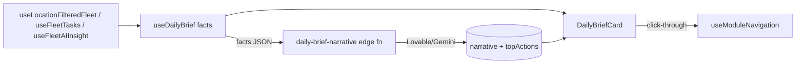

# Command Center — Daily Brief + Dashboard Refinement (Plan)

Status legend: ✅ done · 🔜 next (Lovable) · ⏳ later

## North star
Exotic rental operators open the app and within 3 seconds know: what's happening today, what needs them, and where the money is. Save time, make money. We **refine** `DashboardOverviewEnhanced.tsx` in place — we do not rebuild the Command Center. No new sidebar icons, no bloat. Everything additive and feature-flagged (`dailyBrief`) so current users are unaffected until it's turned on.

## Decisions locked
- **Brief engine = Hybrid:** facts computed deterministically (exact, free, instant); Rari/AI only writes the prioritized punch-list narrative. Numbers never come from the AI.
- **Customization = role-based default first** (Owner/Admin vs Manager vs Operator). Drag-and-drop deferred (the dormant `CustomizableDashboard.tsx` stays parked).
- **Weekly digest = folded:** the daily brief is the hero; "This Week" becomes a secondary view; the duplicate MotorIQ digest card is removed.

## Workflow
Lovable is `main`-only and cannot read branches/PRs. So: number-sensitive logic is built + verified locally, merged to `main` as small inert commits, then the UI is built in Lovable on `main` via `LOVABLE-PROMPTS.md`. The `dailyBrief` feature flag (not a branch) is the safety net.

---

## Phase status

- ✅ **Phase 0 — Safe base.** Clean clone of `main`; old folder kept as archive; tabled billing edits preserved as a patch (separate workstream).
- ✅ **Phase 1 — Daily Brief data layer.** `src/hooks/useDailyBrief.ts` (deterministic `DailyBriefFacts` + severity-ranked `issues[]`). Merged to `main` in #19. Inert until the UI imports it.
- 🔜 **Phase 3 — Daily Brief UI.** `DailyBriefCard.tsx` punch-list hero with click-throughs + one-tap actions. (Lovable Prompt A)
- 🔜 **Phase 4 — Role-aware layout + hero shrink.** Reorder `DashboardOverviewEnhanced`, shrink/hide the photo, role variants, behind the `dailyBrief` flag. (Lovable Prompt B)
- 🔜 **Phase 5 — Fold the weekly digest.** Today | This Week toggle reusing `WeeklyDigestCard`; remove the MotorIQ duplicate. (Lovable Prompt C)
- 🔜 **Phase 2 — Rari narrative.** `daily-brief-narrative` edge fn (facts-in → narrative-out, deterministic fallback, DPA §3.8: counts/non-PII only). (Lovable Prompt D)
- 🔜 **Phase 6 — Flow snags.** Settings `?tab=` deep links; remove dead `DashboardOverview.tsx`. (Lovable Prompt E)

See `LOVABLE-PROMPTS.md` for the exact, guardrailed prompts and the `DailyBriefFacts` data contract.

## Data flow

## Verification (before flipping the flag on)
- Owner, Manager, and Operator each see the correct brief variant.
- Brief numbers match Pulse/Bookings exactly (deterministic).
- AI down / no key → deterministic fallback still renders a useful punch list.
- With `dailyBrief` off, the dashboard is byte-identical to today.

## Out of scope (deferred)
- Drag-and-drop customizable dashboard (infra exists; revisit after the role-based default proves out).
- Daily cron + emailed brief + `daily_briefs` table (start with on-demand + per-day localStorage cache).

---

# Workstream B — Contextual @Mentions (sibling track, AFTER the brief ships) ⏳

**Decision:** Add @mentions on tasks + booking notes as a fully additive feature. Leave the messaging platform fully intact; deprecate standalone chat only later, driven by usage data. (Note: there is no `tenant` user role — the @mention audience is active `team_members`: owner/admin/manager/operator/viewer.)

**Why it's low-risk:** the notification spine already exists (`team_messages.mentions` → `notify_mentioned_users` trigger → `notifications` → realtime/toast + `mention-notification` email/Slack), and the dormant `entity_comments` table already has `content` + `mentions[]` + `parent_id` threading + `entity_type`, with zero frontend.

- **B1** Reuse `entity_comments` as the single comment+mention store (add `entity_type='vehicle_task'`). No new tables.
- **B2** Build one reusable `<MentionInput/>` + `<CommentThread/>` (extract autocomplete from `MessageThread.tsx`); shared `useTeamMembers()`.
- **B3** Drop into `TaskDetailSheet.tsx` + `EnhancedBookingDialog.tsx`; add `updateTask` to `useFleetTasks`.
- **B4** Generalize `notify_mentioned_users` to `entity_comments`; add a `type==='mention'` deep-link handler in `UnifiedNotificationCenter`.
- **B-later (data-driven)** Sunset standalone chat: reroute `ShareWithTeamDialog` + `rari-message-summary`, hide chat UI, keep tables/data. Only after usage justifies it.

**Synergy:** produces a "Mentions / Needs You" inbox the Daily Brief's "Needs you" section can absorb later.
